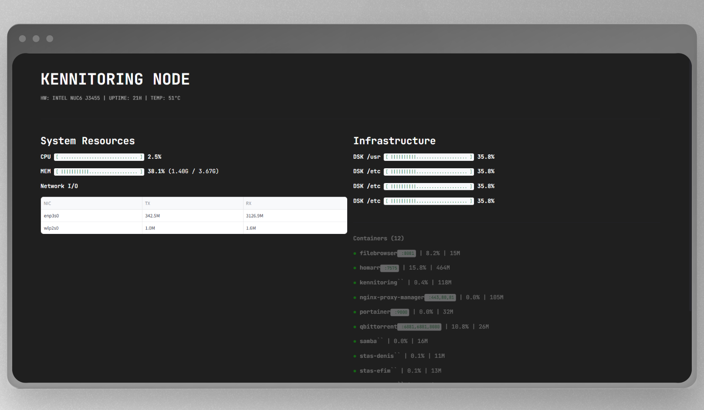

# 🛡️ Kennitoring

**Ultra-lightweight, real-time System & Docker monitoring for resource-constrained edge nodes.**

[](https://www.python.org/downloads/)
[](https://streamlit.io/)
[](https://www.docker.com/)
[](https://opensource.org/licenses/MIT)

---

## 🚀 The Vision

Most monitoring stacks (Prometheus + Grafana + Exporters) consume more resources than the microservices they are supposed to monitor. **Kennitoring** solves this paradox. 

Designed for **HomeLabs, Edge Infrastructure, and SBCs** (Intel NUC, Raspberry Pi, Orange Pi), it provides a "Single Pane of Glass" view into your hardware with a near-zero footprint. It was born to monitor decentralized nodes running high-load services like **Wireguard, Xray, and Samba** on low-power Intel Celeron/Pentium silicon.

### ⚡ Performance Benchmarks (Intel® J3455 / 4GB RAM):
* **CPU Usage:** < 3%
* **RAM Footprint:** ~150 MB
* **Disk I/O:** Zero (No persistent DB overhead)

---

## ✨ Key Technical Features

* **🔍 Smart Interface Filtering:** Automatically excludes ephemeral Docker bridges (`br-*`), virtual Ethernet pairs (`veth*`), and loopbacks. Focus only on physical NICs and active VPN tunnels.
* **🐳 Docker Engine Native:** Deep integration via `docker-py`. Monitor container health, resource pressure, and orchestration status in real-time.
* **📊 Volatile Telemetry History:** Implements `st.session_state` with `collections.deque` for rolling time-series data without the weight of an external database.
* **🛠️ Hardware-Agnostic Storage:** Intelligent deduplication of mount points by physical device ID. Accurate reporting for complex partition layouts.
* **🎨 High Information Density:** Custom CSS-injected Streamlit UI optimized for "Couch Monitoring" on 32" screens or tablets.



---

## 🛠️ Technology Stack

| Layer | Technology |
| :--- | :--- |
| **Language** | Python 3.10+ |
| **UI Framework** | Streamlit (High-density Dashboard) |
| **System Telemetry** | `psutil` (Low-level system utilities) |
| **Orchestration** | `docker-py` (Docker Engine SDK) |
| **Data Handling** | `pandas` & `collections.deque` |

---

## 📦 Deployment

### The "One-Liner" (Docker)
The recommended way to deploy Kennitoring. Just mount the socket and go:

```bash
docker run -d \
  --name kennitoring \
  --restart unless-stopped \
  -v /var/run/docker.sock:/var/run/docker.sock:ro \
  -p 8050:8050 \
  efimr/kennitoring:latest
```
### Manual Installation

```bash
# Clone the repository
git clone [https://github.com/efrom-K/kennitoring.git](https://github.com/efrom-K/kennitoring.git)
cd kennitoring

# Install core dependencies
pip install -r requirements.txt

# Launch the engine
streamlit run monitor.py
```
---

## 🗺️ Roadmap

* **[ ] Container Control:** Integration of Start/Stop/Restart triggers via UI.
* **[ ] Alerting Engine:** Telegram & Webhook notifications for resource threshold breaches.
* **[✅] Thermal Insights:** Real-time monitoring for NVMe and CPU package temperatures.
* **[ ] Multi-node View:** Ability to aggregate telemetry from multiple Kennitoring agents.

---

## 👨‍💻 Author
Efim Romanchenko – *Infrastructure Engineer & AI Researcher*
* **LinkedIn:** https://www.linkedin.com/in/efim-romanchenko/
* **Projects:** Focused on high-performance networking and AI-driven diagnostics (VetAI).

---

*Give a ⭐️ if this project helped your HomeLab stay lean and cool!*